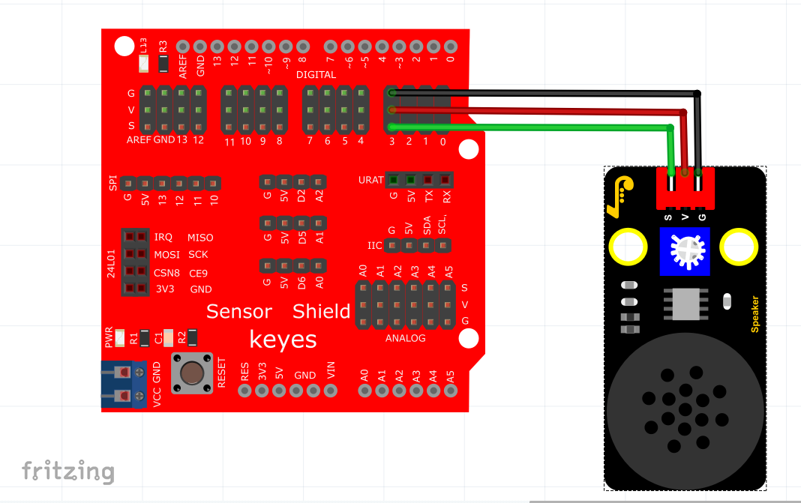

# Arduino


## 1. Arduino简介  

Arduino是一款开源电子原型平台，旨在为各种电子项目提供易于使用的硬件和软件解决方案。Arduino开发板基于微控制器，可以通过Arduino IDE编写程序，支持多种编程语言，尤其是C/C++。此平台广泛应用于DIY项目、教育、艺术创作和原型开发等领域。  

Arduino的优势在于其简洁的开发环境和丰富的社区支持，用户可以轻松地找到教程和示例代码。Arduino硬件包括多个型号的开发板、传感器、执行器等，可以实现多种功能的项目，如传感器数据采集、机器人控制、环境监测等。  

## 2. 接线图  

  

## 3. 测试代码  

```cpp  
int beeppin = 3; // 定义喇叭引脚为D3  

void setup() {  
    pinMode(beeppin, OUTPUT); // 定义功放喇叭模块数字口为输出模式  
}  

void loop() {  
    tone(beeppin, 262); // DO播放1000ms  
    delay(1000);  
    tone(beeppin, 294); // Re播放750ms  
    delay(750);  
    tone(beeppin, 330); // Mi播放625ms  
    delay(625);  
    tone(beeppin, 349); // Fa播放500ms  
    delay(500);  
    tone(beeppin, 392); // So播放375ms  
    delay(375);  
    tone(beeppin, 440); // La播放250ms  
    delay(250);  
    tone(beeppin, 494); // Si播放125ms  
    delay(125);  
    noTone(beeppin); // 停止播放一秒  
    delay(1000);  
}  
```  

## 4. 代码说明  

在本实验中，我们使用了`tone()`函数，其语法为`tone(pin, frequency)`，其中`pin`为生成音调的Arduino引脚，`frequency`为音调的频率（单位为Hz，范围为0 ~ 65,535）。`tone()`函数在指定的引脚上生成一个方波以产生声调，直到调用`noTone()`来停止生产音调。  

该引脚应连接到压电蜂鸣器或其他扬声器以播放音调。在本例中，我们的代码顺序播放了多种频率的音调，对应的时长依次为1000毫秒、750毫秒、625毫秒、500毫秒、375毫秒、250毫秒和125毫秒，最后播放间隔为1000毫秒。注意，使用`tone()`函数在多个引脚上播放不同音高时需确保在调用下一个音高前先调用`noTone()`停止先前音高的播放。  

## 5. 测试结果  

当我们成功上传测试代码并上电后，功放喇叭模块将循环播放对应频率和节拍的声音：DO一拍，Re 0.75拍，Mi 0.625拍，Fa 半拍，So 0.375拍，La 四分之一拍，以及 Si 0.125拍。用户可以通过修改频率和时长实现不同的音调和节奏。


