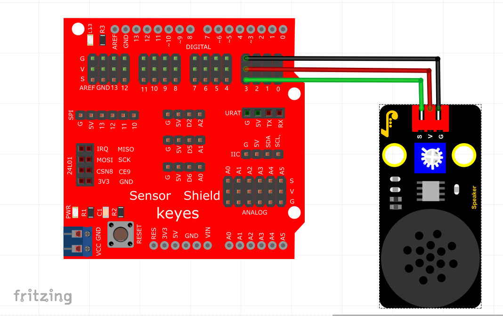

# KidsBlock

## 1. Kidsblock简介  

Kidsblock是一款针对儿童和初学者设计的可视化编程工具，旨在通过简单的拖放式界面，使用户能够快速掌握编程与电子技术。该平台支持多种硬件，如Arduino和Micro:bit，为用户提供了丰富的互动学习体验。Kidsblock不仅包含传统的编程模块，还融合了电子元件的应用，以激发孩子们的创造力和解决问题的能力。  

Kidsblock特别适合教育环境，教师可以利用它设计有趣的编程课程，并让学生在轻松愉快的氛围中学习技术知识。软件提供了大量示例和教程，以帮助用户逐步建立自身的编程能力。  

## 2. 接线图  

  

## 3. 测试代码  

  

## 4. 代码说明  

### 4.1 添加扩展  

在左下方点击“添加扩展”，找到“无源蜂鸣器”模块，点击加载后会在界面下方显示。  

  

### 4.2 拖出代码块  

将无源蜂鸣器的代码块拖出，设置管脚信号端接口为D3，因此设置为3。  

  

  

### 4.3 音调与节拍设置  

音调设置对应于模块上无源蜂鸣器发出的频率，节拍对应于各个频率延迟的时间，1个节拍即为1秒的延迟。  

## 5. 测试结果  

上传测试代码成功，上电后，8002B喇叭功放模块将循环播放对应频率和节拍的声音。使用时请注意，先将音量旋钮逆时针调至最小，再慢慢顺时针增大，以避免烧坏喇叭。

