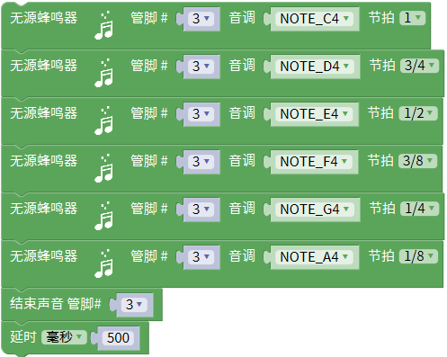

# Mixly

## 1. Mixly简介  

Mixly是一种专为初学者设计的可视化编程环境，允许用户通过简单的图形化界面进行编程，适用于Arduino和其他微控制器的开发。它结合了拖放式的编程方式，使得儿童和非专业用户能够轻松入门编程。Mixly支持多种项目和模块，让用户能够创建有趣和互动性的电子项目，促进他们的创造力和动手能力。  

通过Mixly，用户可以快速构建程序，而无需学习复杂的代码语法，从而更专注于项目的逻辑和功能实现。该平台提供了丰富的教程和实例，帮助用户在实践中学习编程技能，同时支持Scratch和Arduino C语言。  

## 2. 接线图  

  

## 3. 测试代码  

  

## 4. 代码说明  

### 4.1 设置音调和节拍  

在keyes sensor库下的数字输出单元找到并拖出对应的代码块，设置管脚为D3。音调设置与无源蜂鸣器发出的频率相对应，可以通过点击米思齐软件中的代码按键查看具体频率；节拍则表示各频率延迟的时间，1个节拍相当于1秒的延迟。  

  

### 4.2 停止播放  

再拖出一个数字输出单元，管脚同样设置为D3，以便在不播放时停止声音。  

  

  

## 5. 测试结果  

通过上传测试代码并上电后，8002B喇叭功放模块将循环播放对应的频率和节拍声音。使用时请注意，先将音量旋钮逆时针调到最小，再慢慢顺时针增大，以避免烧坏喇叭。

