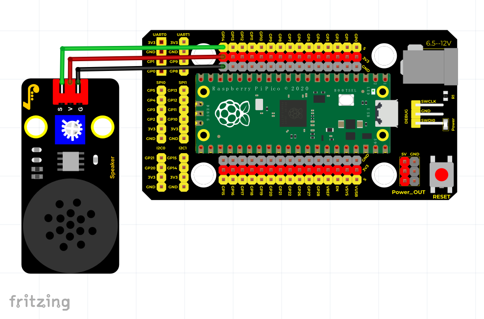

# Python


## 1. Python简介  

Python是一种高级编程语言，以其清晰的语法和易于学习而受到广泛欢迎。它兼容多种编程范式，包括面向对象编程和功能编程。由于其强大的库和框架支持，Python常用于数据分析、人工智能、网页开发、自动化等多个领域。Python的简洁性和可读性使得其成为初学者和专业开发者的首选语言，旨在提高开发效率和代码维护性。此外，Python的活跃社区和丰富的资源为学习者提供了大量的支持和帮助。  

## 2. 接线图  

  

## 3. 测试代码  

```python  
from machine import Pin, PWM  
from time import sleep  

pwm = PWM(Pin(14))  # 设置14引脚为PWM输出引脚  
pwm.freq(1000)  # 设置频率为1000  

while True:  
    for duty in range(65025):  # 给duty赋值  
        pwm.duty_u16(duty)  # 设置占空比比例  
        sleep(0.0001)  

    for duty in range(65025, 0, -1):  
        pwm.duty_u16(duty)  # 设置占空比比例  
        sleep(0.0001)  
```  

## 4. 代码说明  

在这段代码中，首先通过`PWM(Pin(14))`设置引脚14为PWM输出引脚。接着使用`pwm.freq(1000)`设置PWM信号的频率为1000Hz。占空比通过`pwm.duty_u16(duty)`进行设置，其中`duty`值在0到65535之间的范围内。程序中有两个循环：  

1. 第一个循环：将占空比从0逐步增加到65535，形成逐渐增大的声音。  
2. 第二个循环：将占空比从65535逐步减少到0，形成逐渐减小的声音。  

这两个循环相互交替，使得功放喇叭模块的声音实现了从低到高再到低的变化，达到循环播放的效果。  

## 5. 测试结果  

成功上传测试代码后，上电后，功放喇叭模块的声音将从低到高，再由高到低地循环变化，形成持续的动态效果。


